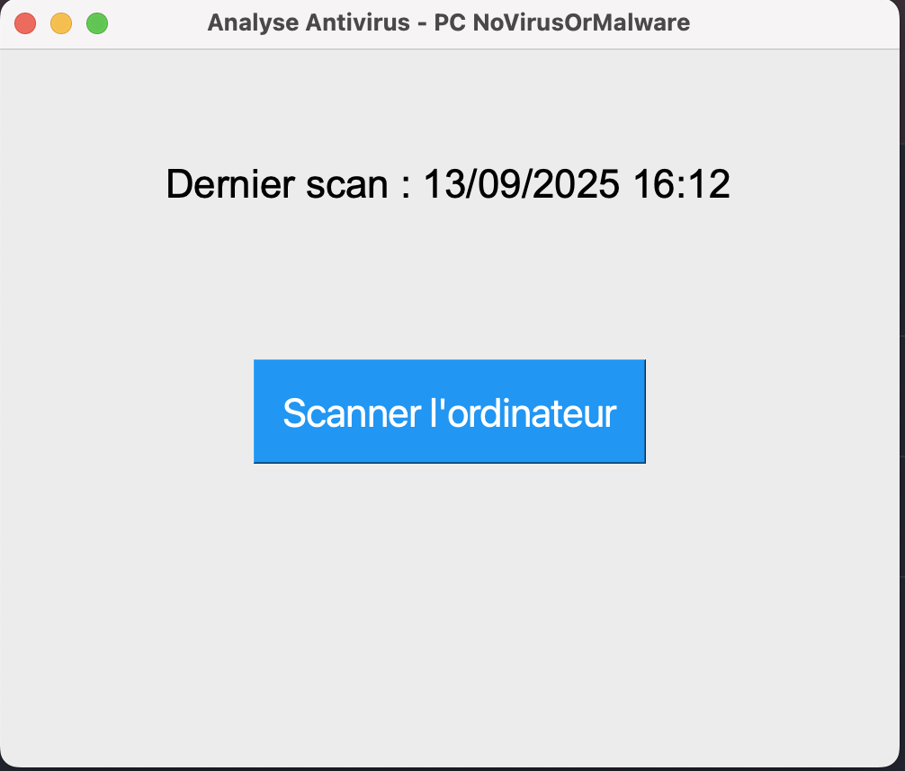
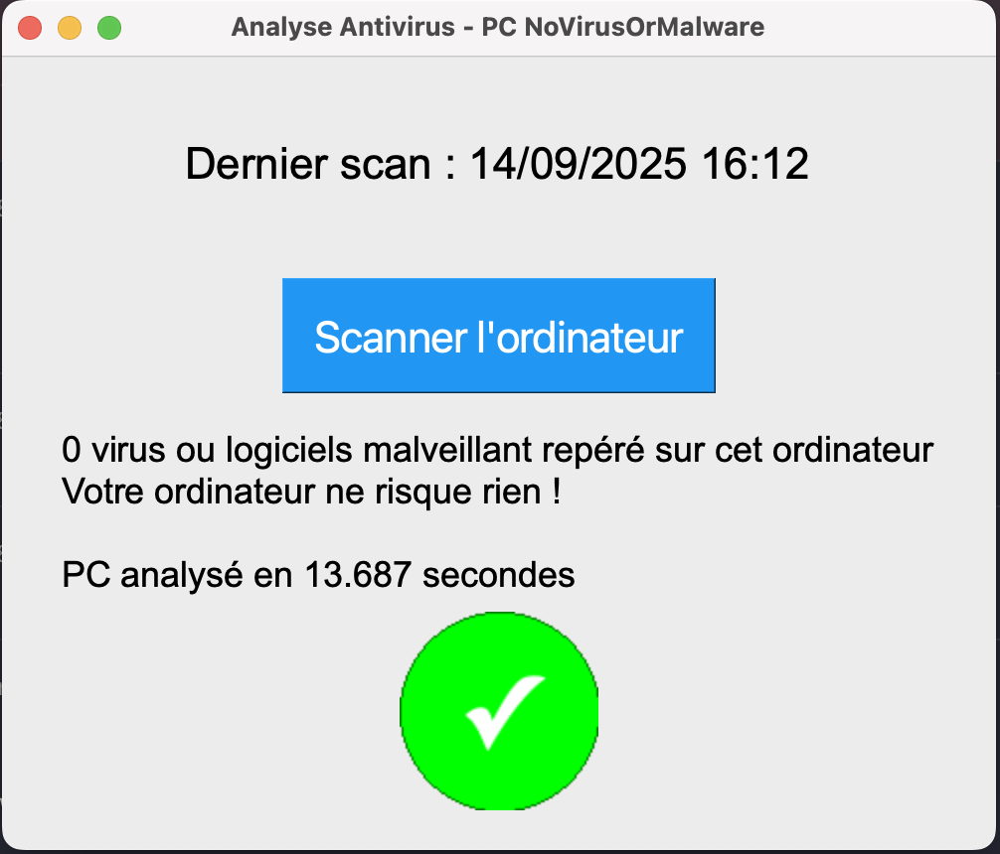

# Logiciels Divers | MamieOS

## Faux utilitaires

Ma grand-mère est habitué à lancer CCleaner pour nettoyer son PC et lancer un scan antivirus manuel.  
Malgré le fait que ça ne soit pas forcément très utile pour son utilisation, les habitudes ont la vie dures.

J'ai donc développé 2 faux logiciels pour simuler ce comportement. Ils ne font que de l'affichage (aucune réél action derrière), mais ça la rassurera de réaliser encore un équivalent de ces 2 actions.

Ce sont des scripts Python tout simple.

Voir [le code](./fake-utils/README.md) et [les releases](#TODO) si vous voulez les utiliser également.

## Contrôle à distance

TODO tester RustDesk

## Jeux

Liste de jeux gratuit pour l'occuper pendant sa retraite :
TODO
